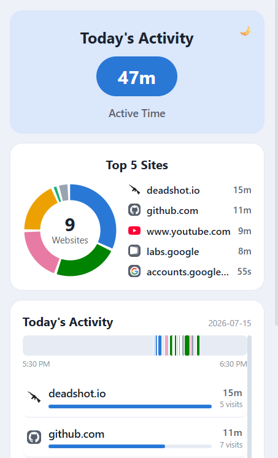
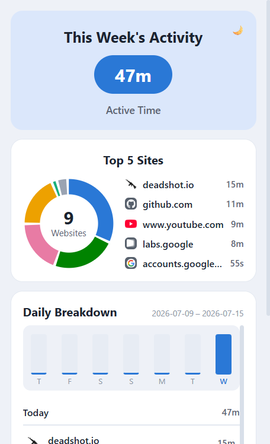
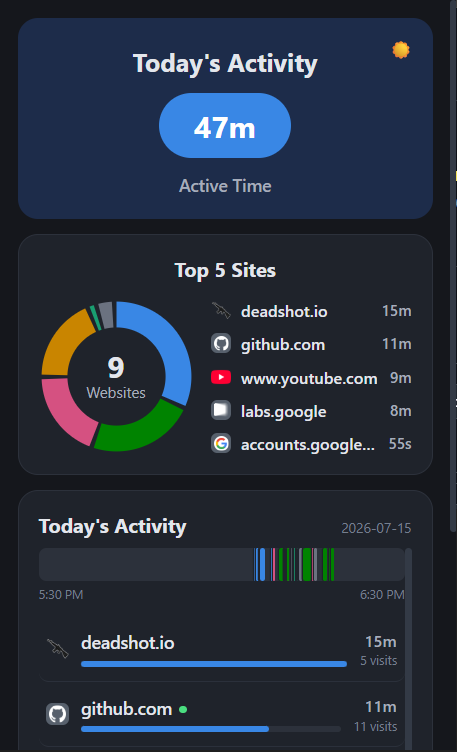
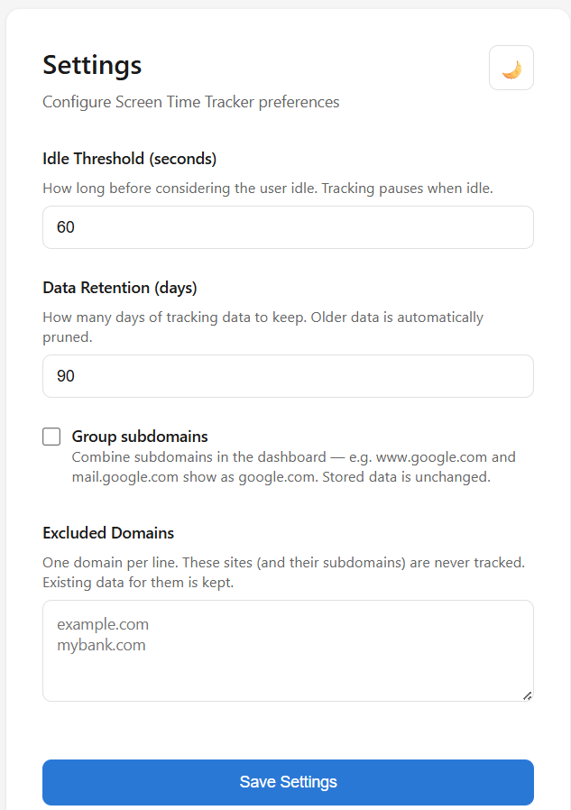

# Screen Time Tracker

Chrome extension that tracks how much time you spend on each website. Data stays on your machine — no accounts, no servers, no network requests.

## Screenshots

<!--
  Add your screenshots to the screenshots/ folder using the filenames below
  and they will appear here automatically. Suggested capture size: the popup
  is 360px wide — screenshot it at 100% zoom for crisp images.
-->

| Today view | This Week view |
|:---:|:---:|
|  |  |

| Dark mode | Settings page |
|:---:|:---:|
|  |  |

## Installation

1. Download or clone this repository
2. Open `chrome://extensions` in Chrome
3. Turn on **Developer mode** (top-right toggle)
4. Click **Load unpacked** and select the project folder
5. Pin the icon from the puzzle-piece menu — tracking starts immediately

## What it does

Click the extension icon to see a card-based dashboard of where your time went:

- **Hero card** — total active time for the current view in a big pill, plus an insight line when there's something worth saying ("Longest focus stretch today: 52m on github.com", "You've opened twitter.com 31 times today", "youtube.com: 40% less than this day last week")
- **Top 5 Sites** — a donut chart (top 5 domains + Other, total site count in the center) with a legend
- **Day timeline** — the Today view opens with a horizontal strip of your day: one colored block per continuous visit, hour-aligned axis, hover for domain and clock range
- **Activity list** — every domain sorted by time with a progress bar and visit count ("47 visits", with average visit length in the tooltip); the week view adds a 7-day column chart and groups domains by day

The footer's **This Week** button switches between Today and last-7-days views.

The dashboard includes the in-progress session and ticks up live while the popup is open — you don't have to wait for the next checkpoint to see current activity. The site being tracked right now gets a pulsing green dot. Durations under a minute show in seconds ("45s"). Each domain shows its real favicon, served by Chrome's local `_favicon` cache — no network requests. If the browser doesn't support the favicon API, rows fall back to colored monogram tiles generated from the domain name. Hovering a row shows its share of that day's total.

Bottom of the popup has pill buttons: **This Week** (view switch), **Export Data** (choose JSON or CSV), and **Clear History**.

Dark/light mode toggle in both the popup and the settings page.

## How tracking works

The background service worker (`background.js`) listens to Chrome tab and window events:

| Event | What happens |
|---|---|
| Switch tabs | Old session ends, new one starts for the active tab's domain |
| Navigate within a tab | Same — ends old, starts new |
| Switch windows | Focus changes to the active tab in the new window |
| Tab closed | Session for that tab is flushed to storage |
| Chrome loses focus (another app, browser, or profile) | Session ends; nothing is tracked |
| Idle/lock screen | Tracking pauses entirely |
| Unlock/resume | Tracking resumes only if a Chrome window is focused |

Sessions can only start while a window of this Chrome profile has focus — every entry point (tab events, idle recovery, service-worker restart) checks focus first, and the 60-second checkpoint re-verifies it, ending any session that survived a missed blur event.

A checkpoint alarm fires every 60 seconds. If the current session is still going, it saves the elapsed time as a chunk and resets the start time. This means if Chrome kills the service worker mid-session, you only lose up to 60 seconds of data instead of everything since the last tab switch.

Sessions crossing midnight are split at the boundary — the portion before midnight goes into the previous day's bucket, the portion after goes into today's.

If the gap between checkpoints is longer than 30 minutes (sleep, shutdown, etc.), that time is discarded. Browsing sessions don't get credit for time the computer was off.

## Data format

All data lives in `chrome.storage.local`. Daily usage is stored under keys like `usage:2026-07-07`:

```json
{
  "usage:2026-07-07": {
    "github.com": 5400000,
    "youtube.com": 1200000,
    "stackoverflow.com": 900000
  }
}
```

Values are in milliseconds. Alongside the totals, each day keeps a session log under `sessions:YYYY-MM-DD` — an array of `[startMs, durationMs, domain]` triples, one per continuous visit (checkpoint chunks are coalesced back together, capped at 1000 entries/day). The log powers the timeline, visit counts, and insights, and is covered by the same retention pruning, Clear History, and JSON export as the daily totals.

The current in-progress session is stored as `currentSession`:

```json
{
  "currentSession": {
    "domain": "github.com",
    "tabId": 123,
    "startTime": 1751923200000
  }
}
```

`currentSession` is persisted so the service worker can resume tracking after being restarted by Chrome. On startup, if the saved session's elapsed time is under 30 minutes, it's flushed. The worker then queries `chrome.idle.queryState()` — a restarted worker loses its in-memory idle flag, and Chrome only fires idle events on state *changes* — and starts a new session for the active tab only if the user is actually active.

## Settings

Click the ⚙️ button in the popup (or right-click the extension icon → Options):

| Setting | What it controls | Range | Default |
|---|---|---|---|
| Idle Threshold | Seconds of inactivity before tracking pauses | 15–300 | 60 |
| Data Retention | Days before old usage data is deleted | 7–365 | 90 |
| Group Subdomains | Combine subdomains in the dashboard (www.google.com + mail.google.com → google.com). Display-only; stored data keeps full hostnames | on/off | off |
| Excluded Domains | Domains (and their subdomains) that are never tracked. Existing data for them is kept | one per line | empty |

Values outside the numeric ranges are clamped on save.

The idle threshold uses `chrome.idle.setDetectionInterval()` — the actual Chrome idle detection has a minimum of 15 seconds regardless of what you set.

Pruning runs once a day via a Chrome alarm. It compares each dated key (`usage:YYYY-MM-DD` and `sessions:YYYY-MM-DD`) against the retention cutoff and deletes anything older.

## Permissions

```
"permissions": ["tabs", "storage", "alarms", "idle", "downloads", "favicon"]
```

- `tabs` — read active tab URLs to extract domains
- `storage` — persist usage data locally
- `alarms` — session checkpoints (every 60s) and daily data pruning
- `idle` — detect when the screen is locked or the user is idle
- `downloads` — export data as a JSON or CSV file
- `favicon` — show site icons from Chrome's local favicon cache (no network; requires Chrome 104+, monogram fallback otherwise)

No `host_permissions`. No content scripts. The extension never makes network requests.

## Ignored URLs

Internal browser and extension pages are skipped: `chrome://`, `chrome-extension://`, `edge://`, `devtools://`, `about:`, `new-tab-page:`. Tabs on these pages don't generate tracking data. If you switch to an ignored page, the current session is ended but no new one starts.

## Popup layout

```
┌──────────────────────────────┐
│ ╭──────────────────────╮ [🌙] │
│ │   Today's Activity   │     │  ← hero card
│ │      ( 2h 15m )      │     │  ← total time pill
│ │      Active Time     │     │
│ ╰──────────────────────╯     │
│ ╭──────────────────────╮     │
│ │      Top 5 Sites     │     │
│ │   ◔ 12      ▪ github │     │  ← donut + legend
│ │  Websites   ▪ youtube│     │
│ ╰──────────────────────╯     │
│ ╭──────────────────────╮     │
│ │ Today's Activity     │     │
│ │ Ⓖ github.com  1h 30m │     │  ← scrollable list
│ │ ▬▬▬▬▬▬▬▬▬▬░░░░       │     │
│ │ Ⓨ youtube.com   25m  │     │
│ │ ▬▬▬▬▬░░░░░░░░░       │     │
│ ╰──────────────────────╯     │
│ (This Week)(Export)(Clear)   │  ← pill buttons
└──────────────────────────────┘
```

The week view swaps the hero to the 7-day total, aggregates the donut across the week, opens the list with a 7-day column chart (hover a column for the exact time), and groups domains under day headers ("Today", "Yesterday", "Mon, Jul 5", etc.).

## Project files

```
manifest.json    Manifest V3 config — permissions, module service worker, popup, options page
lib.js           Shared pure helpers — domain parsing, date keys, formatting, HTML escaping, prune selection
session.js       Session manager — persistence, checkpointing, midnight splitting, sleep cap (storage and clock injected)
background.js    Service worker — wires Chrome tab/window/idle/alarm events to the session manager
popup.html       Dashboard markup
popup.css        Dashboard styles (light + dark via CSS custom properties)
popup.js         Dashboard logic — data loading, rendering, theme toggle, export/clear
options.html     Settings page markup + inline styles
options.js       Settings page logic — load/save settings, theme toggle
icons/           Extension icons (16, 48, 128px PNGs)
package.json     Enables ES modules for Node so tests can import the extension code
test.js          Unit tests (run with `node test.js`)
```

## Running tests

```bash
node test.js
```

The tests import the real `lib.js` and `session.js` modules — the same code the extension runs — with a mock storage backend and a fake clock. They cover domain parsing, session switching, checkpoint flushing, midnight splitting, the sleep cap, the 500ms debounce, worker-restart session restore, pruning, the session log (coalescing, cap, midnight), exclusions, subdomain grouping, CSV export, visit counts, and the insight rules.


```
Build by Harinayan 🤖
```
